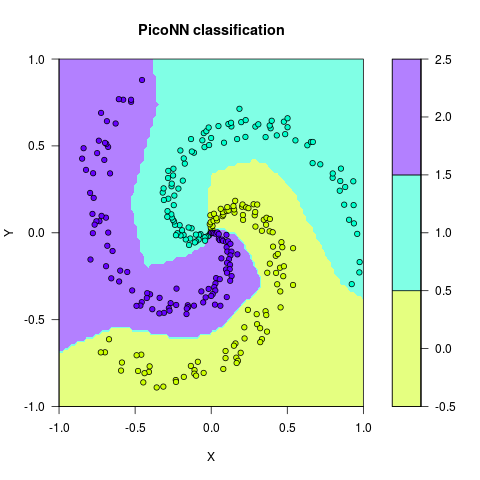

# PicoNN

## A small 2-layer neural network in C++

|Unix |
|-------|
||

[PicoNN](https://github.com/pliptor/PicoNN)

* A self-contained neural network testing and studying platform.
* It has **less than 500 lines of code**. 
* It is not meant for building a full blown application. You may want to try [tiny-dnn](https://github.com/tiny-dnn/tiny-dnn) for a comprehensive platform. 
* Concepts you may learn with this code:
    - *Forward propagation*
    - *Back propagation*
    - *Gradient descent*
    - *Regularization*
    - *ReLU activation*
    - *Metrics to track convergence*
    - *Effects of floating point precision*
    - *Effects of weight and bias initialization*
* The code is a translation of the Python code available in the excellent and freely available neural network [cs231n course](http://cs231n.github.io/neural-networks-case-study/) by Andrej Karpathy. You are encouraged to check his web-page. It has all the theory in great detail. Also, you may try his original Python code instead.

## What does the code do?

It segments a group of KxN=300 points, where K=3 is the number of distinct classes and N=100 the number of points in each class.

Data | Segmented Data
:------:|:--------:
 |

## How To

This code was developed in Linux (Ubuntu 16.04.1LTS) but it should be easy to build it in any platform with a C++11 compiler. It has no dependencies and just one cpp file and two header files.

* In Linux, type `make` to build the executable `piconn`, which will be then found in the `build` folder.
* To run the executable type `./piconn`

The output should look like: 

~~~
iteration      0: loss 1.098764 data_loss 1.098738 reg_loss 0.000026     training accuracy 33.67%
iteration   1000: loss 0.301150 data_loss 0.195622 reg_loss 0.105528     training accuracy 91.67%
iteration   2000: loss 0.257442 data_loss 0.132855 reg_loss 0.124587     training accuracy 96.33%
iteration   3000: loss 0.249705 data_loss 0.121657 reg_loss 0.128048     training accuracy 97.33%
iteration   4000: loss 0.247016 data_loss 0.117306 reg_loss 0.129711     training accuracy 98.33%
iteration   5000: loss 0.245445 data_loss 0.115239 reg_loss 0.130206     training accuracy 98.67%
iteration   6000: loss 0.244663 data_loss 0.114385 reg_loss 0.130277     training accuracy 98.67%
iteration   7000: loss 0.244248 data_loss 0.113716 reg_loss 0.130532     training accuracy 98.67%
iteration   8000: loss 0.243881 data_loss 0.113107 reg_loss 0.130774     training accuracy 98.67%
iteration   9000: loss 0.243553 data_loss 0.112449 reg_loss 0.131104     training accuracy 99.00%
training accuracy 99.00%
~~~

The last line shows that the segmentation was performed with 99% accuracy. The result will not perfectly match the original Python code. This is because of differences in random number generation.

## Comparisson with Support Vector Machine (SVM)

The input was also tested with the support vector machine (SVM) classification method for reference. SVM with radial kernel works pretty well with this particular data (R script included). It has four kernels available (radial basis, linear, polynomial and sigmoid). The results are suboptimal since all kernels were tested using default parameters.

Radial Basis | Linear 
:------:|:--------:
 |
Polynomial | Sigmoid 
 |

